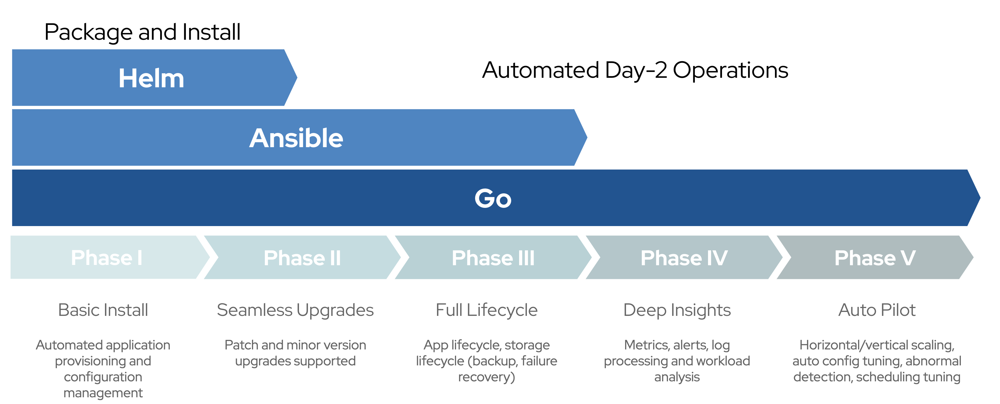

# openshift-by-example-operators

## What is it?

This is a companion project to [`openshift-by-example`](https://github.com/redhat-france-sa/openshift-by-example) and the associated article that now tackle the topic of Operators development and packaging using tools and practices from the [Operator Framework](https://operatorframework.io).

More precisely, this repository contains samples on how to develop Operators using the [Operator SDK](https://sdk.operatorframework.io) and the 3 different technologies embedded: [Helm](#helm-operator), [Ansible](#ansible-operator) and [Go language](#go-perator). We hope it will help you understand the pro and cons of different approaches and how they can map on the Operators Maturity Model phases.

## Pre-requisites

* `operator-sdk` should be installed and present into your `$PATH`. We use latest `1.0.0` version and previous `0.19.2`version. Just check https://master.sdk.operatorframework.io/docs/installation/install-operator-sdk/ on how to install it,
* `docker` (or another tool compatible with multi-stage Dockerfiles) should be installed and present into your `$PATH`. Minimum version is `17.03+`,
* `go` should be installed and present into your `$PATH`. Minimum version is Go `1.13`,
* `kubectl` shoud be installed and present into your `$PATH`. `v1.16.0+` is the minimum version,

## Helm Operator

Operator SDK allows creating Operator using/re-using [Helm Charts](https://helm.sh). Whilst they're great starting points, we tend to think that Helm only allows you to support the first phases of the maturity model.

Discover how to develop such Operator on the [dedicated Helm page](HELM.md).

| Pros                     | Cons                     |
| ------------------------ | ------------------------ |
| | |

## Ansible Operator

Discover how to develop such Operator on the [dedicated Ansible page](ANSIBLE.md).

| Pros                     | Cons                     |
| ------------------------ | ------------------------ |
| | |

## Go Operator

Discover how to develop such Operator on the [dedicated Go page](GO.md).

| Pros                     | Cons                     |
| ------------------------ | ------------------------ |
| | |

## OLM manifests, Scorecard and OCI Bundles

## Operators Registry and Catalog