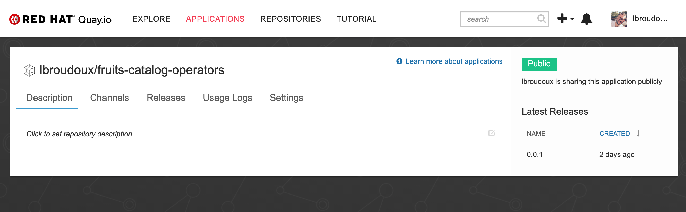
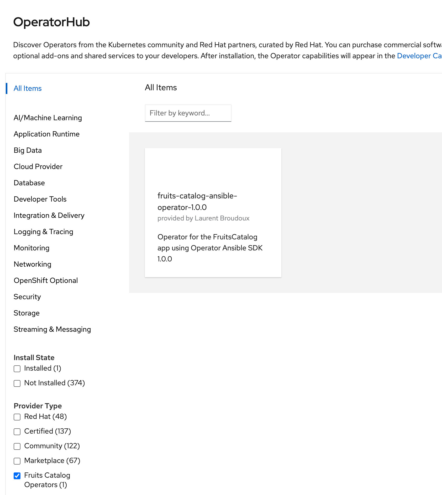
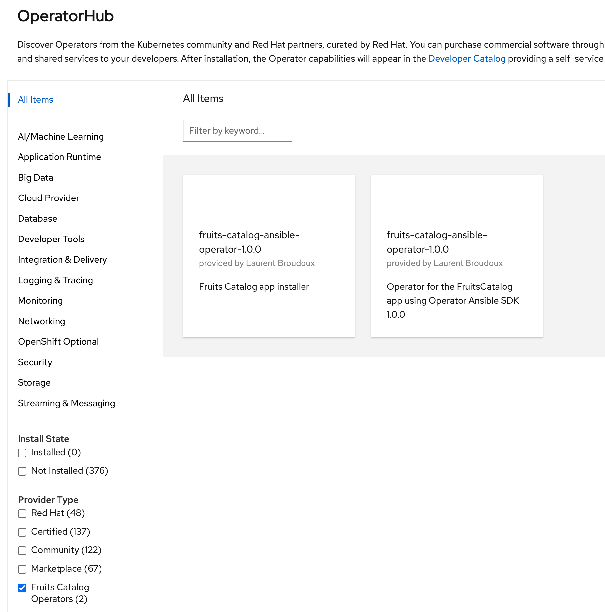

In this project, we are going in the details of building a custom Operator Catalog in order to enrich the default marketplace being present within a Kubernetes / OpenShift cluster.

In the case of default setting of OpenShift, you may find some additional, helpful information in [Managing custom catalogs](https://docs.openshift.com/container-platform/4.5/operators/olm-managing-custom-catalogs.html#olm-managing-custom-catalogs-bundle-format).

## Pre-requisites

Depending on how you plan to build your Operator Registry and deploy, you may need `opm` or `operator-courier`. The Operator Package Manager is necessary for building registry using pre-existing Operator OCI bundles. The Operator Courier is necessary for uploading your Operator manisfests to Quay.io if you want to use it a global registry.

* You may find `opm` at https://github.com/operator-framework/operator-registry/releases. Download the binary corresponding to your platform and place it somewhere into your `$PATH`.

Tests were done using following version:
```
$ opm version                                                                                      
Version: version.Version{OpmVersion:"v1.13.8", GitCommit:"0deaced", BuildDate:"2020-08-25T12:44:21Z", GoOs:"darwin", GoArch:"amd64"}
```

* You may find `operator-courier` at https://github.com/operator-framework/operator-courier. Install the binary using the `pip3` package manager; it will be placed into your `$PATH`.

Tests were done using the following version:
```
$ operator-courier -v
2.1.10
```

### Build an Operator Registry

#### Option 1: Build a registry from Manifests

The [operator-registry](https://github.com/operator-framework/operator-registry) project defines a format for storing sets of operators and exposing them to make them available on a cluster. So first, gather and organize your manifests as we did into the `manifests/` folder of this project.

To create a catalog that includes your package, simply build a container image that uses the `upstream-registry-builder` tool to generate a registry and serve it. For example, create a file in the root of your project called `registry.Dockerfile`.

Then just use your favorite container tooling to build the container image and push it to a registry:

```
$ docker build -t quay.io/lbroudoux/fruits-catalog-operators-registry:latest -f registry.Dockerfile .
docker push quay.io/lbroudoux/fruits-catalog-operators-registry:latest
```

#### Option 2: Build a registry from Operator OCI Bundles

Another option for building such a registry container image is to reuse the OCI bundles containing Operators metadata that you may have created within your Operator project using the `operator-sdk`. This option uses the `opm` CLI tool that provides a specific `opm index` command for creating new registry from existings OCI bundles. 

The command to execute can be simply found into `registry-from-bundes.sh` script at the root of project.

#### Option 3: Reuse Quay.io internal registry

This option is only suitable if you want to publically expose your Openrator Catalog. Note that is does not prevent you for charging the Operator usage. Once it is deployed on a cluster, it could rely on an activation key or something to actually do the job ;-)/

First thing will be to retrieve all the manifests from your Operator and put them into a `bundles/` folder like we did in this project.

Then you'll have to retrieve an authentication token from Quay.io. For this, we have provided the utility script `gen-quay-auth-token.sh`. Once you got your token, just call the following command to upload your manifests to Quay.io.

```
$ operator-courier push bundles lbroudoux fruits-catalog-operators 0.0.1 "<my-token-from-quay-io>"
```

After few seconds and refreshing your Quay.io page if it's the fritsd time you're deploying an Application, you should have access to something like this:




### Deploy your catalog on Kubernetes

#### Option 1: Deploy a CatalogSource

This option is suitable if you have built your Operator registry using option 1 or option 2 or previous step. Just deploy a new `CatalogSource` like the one below into the `openshift-marketplace` project: 

```yaml
apiVersion: operators.coreos.com/v1alpha1
kind: CatalogSource
metadata:
  name: fruits-catalog-operators
spec:
  sourceType: grpc
  image: quay.io/lbroudoux/fruits-catalog-operators-registry:1.0.0
  displayName: Fruits Catalog Operators
  publisher: Fruits Catalog Team

```

Here is the command:

```
$ oc create -f fruits-catalog-operators-catalog-source.yml -n openshift-marketplace
```

After a few seconds, the OperatorHub of OpenShift should be enriched with a new Provider like your see below:



You can check on the cluster:

```
oc get catalogsources -n openshift-marketplace                                                [12:17:35]
NAME                           DISPLAY                    TYPE   PUBLISHER             AGE
certified-operators            Certified Operators        grpc   Red Hat               9d
community-operators            Community Operators        grpc   Red Hat               9d
fruits-catalog-operators       Fruits Catalog Operators   grpc   Fruits Catalog Team   3d
redhat-marketplace             Red Hat Marketplace        grpc   Red Hat               9d
redhat-operators               Red Hat Operators          grpc   Red Hat               9d
```

`CatalogSource` implies the execution of a new `Pod` that serves Operator bundle locally:

```
oc get pods -n openshift-marketplace                                                          
NAME                                            READY   STATUS    RESTARTS   AGE
certified-operators-66bf4f46ff-mzdcn            1/1     Running   0          3d3h
community-operators-7d85cb9886-gxkrp            1/1     Running   0          3d3h
fruits-catalog-operators-qbpjk                  1/1     Running   0          3d
marketplace-operator-df484cccc-pm2md            1/1     Running   0          9d
redhat-marketplace-85dd977dc-x2fb4              1/1     Running   0          3d3h
redhat-operators-7d8bb48cf9-nlhd7               1/1     Running   0          3d3h
```

In order to easily upgrade the distributed Operator metadatas, you may find to add an `updateStrategy` to your `CatalogSource` like this:

```yaml
[...]
spec:
  image: quay.io/lbroudoux/fruits-catalog-operators-registry:latest
  updateStrategy:
    registryPoll: 
      interval: 30m
[...]
```

#### Option 2: Deploy an OperatorSource

This option is suitable if you have built your Operator registry using option 3 and if your application has been made `public` on Quay.io. Just deploy a new `OperatorSource` like the one below into the `openshift-marketplace` project: 

```yaml
apiVersion: operators.coreos.com/v1
kind: OperatorSource
metadata:
  name: fruits-catalog-operators-cnr
spec:
  authorizationToken: {}
  displayName: Fruits Catalog Operators
  endpoint: 'https://quay.io/cnr'
  publisher: Fruits Catalog Team
  registryNamespace: lbroudoux
  type: appregistry
```

Here is the command:

```
$ oc create -f fruits-catalog-operators.yml -n openshift-marketplace
```

After a few seconds, the OperatorHub of OpenShift should be enriched with a new Provider like your see below:



```
$ oc get catalogsources -n openshift-marketplace                                                [12:17:35]
NAME                           DISPLAY                    TYPE   PUBLISHER             AGE
certified-operators            Certified Operators        grpc   Red Hat               9d
community-operators            Community Operators        grpc   Red Hat               9d
fruits-catalog-operators       Fruits Catalog Operators   grpc   Fruits Catalog Team   3d
fruits-catalog-operators-cnr   Fruits Catalog Operators   grpc   Fruits Catalog Team   2d1h
redhat-marketplace             Red Hat Marketplace        grpc   Red Hat               9d
redhat-operators               Red Hat Operators          grpc   Red Hat               9d
```

While this approach may seems at first easier, it has some drawbacks:
* New `OperatorSource` implies new deployments on cluster, 
* Local deployment is mirroring Quay.io so if Quay.io is out-of-sight it should also be mirrored,
* This is not as a fined grained as the previous approach because here you're referencing a whole `registryNamespace` and not a precise container image version...

```
$ oc get deployments -n openshift-marketplace                                                  
NAME                           READY   UP-TO-DATE   AVAILABLE   AGE
certified-operators            1/1     1            1           9d
community-operators            1/1     1            1           9d
fruits-catalog-operators-cnr   1/1     1            1           2d1h
marketplace-operator           1/1     1            1           9d
redhat-marketplace             1/1     1            1           9d
redhat-operators               1/1     1            1           9d
```